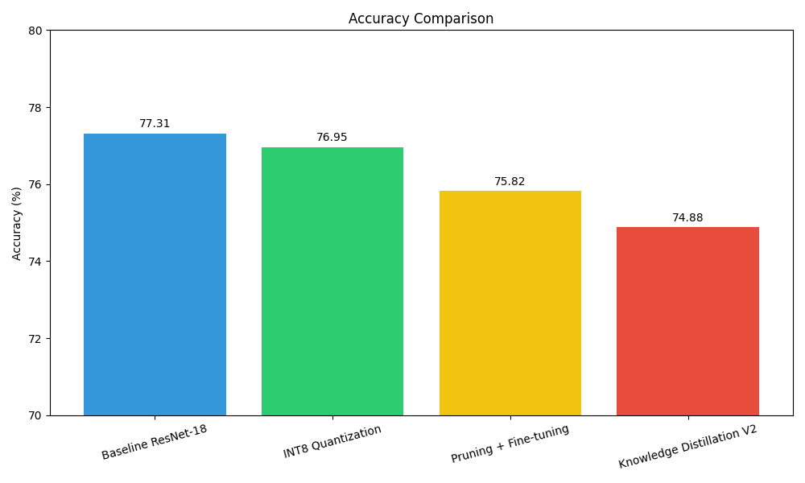
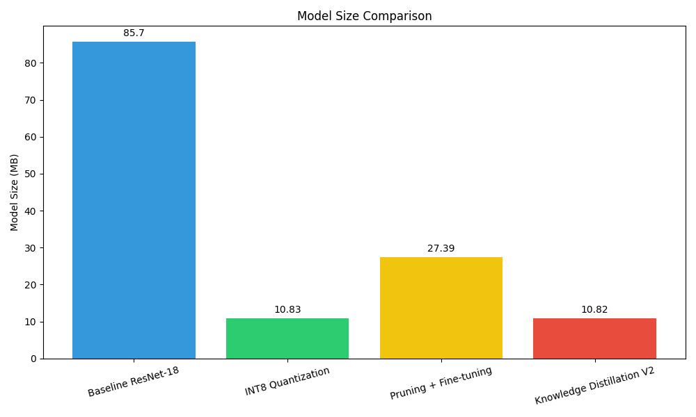
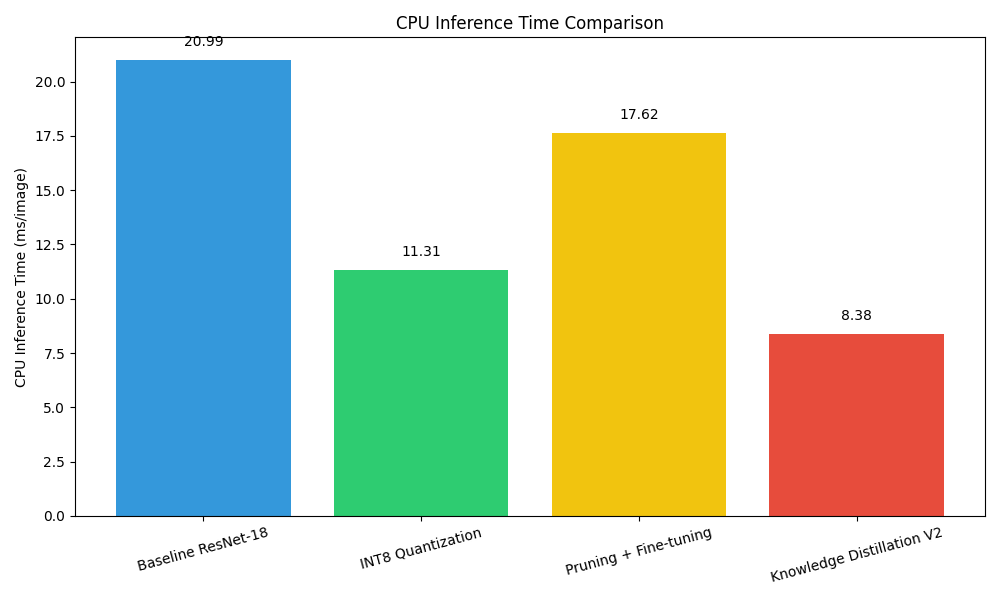

<div align="center">

# EDGE-BENCH - Model Compression Lab

### Edge deployment benchmarking for compressed ResNet-18 models

[](https://www.python.org/)
[](https://pytorch.org/)
[](https://react.dev/)
[](https://fastapi.tiangolo.com/)
[](https://www.cs.toronto.edu/~kriz/cifar.html)
[](#benchmark-results)

</div>

> **EDGE-BENCH** is a reproducible model-compression benchmark and interactive dashboard for evaluating the accuracy, storage, parameter, and CPU-latency trade-offs of ResNet-18 deployment options on CIFAR-100.

It combines PyTorch model workflows, a FastAPI inference service, and a React dashboard. The project compresses the **AI model** itself - never uploaded images, PDFs, or other files.

---

## Table of Contents

1. [Overview](#overview)
2. [Feature Highlights](#feature-highlights)
3. [Benchmark Results](#benchmark-results)
4. [Visual Results](#visual-results)
5. [Compression Techniques](#compression-techniques)
6. [Dashboard](#dashboard)
7. [Architecture](#architecture)
8. [Technology Stack](#technology-stack)
9. [Run Locally](#run-locally)
10. [Deploy to Render and Vercel](#deploy-to-render-and-vercel)
11. [API Reference](#api-reference)
12. [Reproducing Results](#reproducing-results)
13. [Project Structure](#project-structure)
14. [Limitations](#limitations)
15. [Roadmap](#roadmap)
16. [License](#license)

---

## Overview

Deploying neural networks on edge hardware requires a careful balance between accuracy, memory footprint, compute cost, and latency. EDGE-BENCH evaluates four ResNet-18 deployment choices against the same CIFAR-100 baseline:

- **Baseline ResNet-18** - uncompressed accuracy reference.
- **INT8 Quantization** - compact integer representation for strong accuracy retention.
- **Structured Pruning + Fine-tuning** - reduced model structure with recovery fine-tuning.
- **Knowledge Distillation V2** - a lightweight student trained with teacher guidance.

The dashboard presents the recorded benchmark evidence alongside live inference. Live request timing and controlled benchmark CPU latency are intentionally labelled as different measurements.

## Feature Highlights

| Area | Included capability |
|---|---|
| Benchmarking | Accuracy, model size, parameter count, size reduction, accuracy drop, and CPU inference time for all four models. |
| Dashboard | Hash-synchronized sidebar navigation for Overview, Benchmark, Models, Performance, Compression, Edge Deployment, and Inference Lab. |
| Analysis | Accuracy, footprint, Pareto trade-off, and CPU-latency charts based on recorded project results. |
| Inference Lab | Image upload, per-model selection, single-model inference, and same-image comparison across all models. |
| Backend | FastAPI endpoints for benchmark metadata and real PyTorch CPU inference. |
| Reproducibility | Existing checkpoints, scripts, and chart-generation workflow are included in the repository. |

## Benchmark Results

All methods are compared with the same baseline reference. CPU inference represents the recorded benchmark measurement per image.

| Model | Accuracy | Model Size | Parameters | Size Reduction | Accuracy Drop | CPU Inference |
|---|---:|---:|---:|---:|---:|---:|
| **Baseline ResNet-18** | **77.31%** | 85.70 MB | 11,220,132 | 0.00% | 0.00 pp | 20.99 ms/image |
| **INT8 Quantization** | 76.95% | 10.83 MB | N/A | 87.36% | **0.36 pp** | 11.31 ms/image |
| **Pruning + Fine-tuning** | 75.82% | 27.39 MB | 7,159,260 | 68.04% | 1.49 pp | 17.62 ms/image |
| **Knowledge Distillation V2** | 74.88% | **10.82 MB** | **2,820,740** | **87.37%** | 2.43 pp | **8.38 ms/image** |

### Deployment guidance

| Deployment priority | Recommended option | Why |
|---|---|---|
| Highest accuracy | **Baseline ResNet-18** | Highest measured accuracy in this benchmark. |
| Best overall trade-off | **INT8 Quantization** | 87.36% smaller with only a 0.36 percentage-point accuracy drop. |
| Middle-ground option | **Pruning + Fine-tuning** | Meaningful size and parameter reduction with moderate latency improvement. |
| Smallest / fastest benchmark model | **Knowledge Distillation V2** | Smallest model and lowest recorded CPU latency. |

## Visual Results

<table>
  <tr>
    <td width="50%"></td>
    <td width="50%"></td>
  </tr>
  <tr>
    <td align="center"><b>Accuracy comparison</b></td>
    <td align="center"><b>Model size comparison</b></td>
  </tr>
  <tr>
    <td colspan="2"></td>
  </tr>
  <tr>
    <td colspan="2" align="center"><b>CPU inference comparison</b></td>
  </tr>
</table>

## Compression Techniques

### INT8 Quantization

Post-training static quantization converts FP32 weights and activations to INT8 representations. It is the strongest option in this benchmark for preserving baseline accuracy while reducing model size.

### Structured Pruning + Fine-tuning

Magnitude-based structured pruning uses a 20% pruning ratio to remove less-important model structure. The resulting model is fine-tuned to recover accuracy after pruning.

### Knowledge Distillation V2

A lightweight student network learns from the baseline teacher. This V2 experiment uses a temperature of `4.0` and alpha of `0.7`, delivering the smallest footprint and fastest recorded benchmark inference time.

## Dashboard

The React dashboard is organized for a complete compression decision workflow:

1. **Overview** - objective, compression story, and headline KPIs.
2. **Benchmark** - all four models, detailed metrics, and benchmark charts.
3. **Models** - clear model cards for baseline, quantized, pruned, and distilled variants.
4. **Performance** - CPU latency comparison with a note distinguishing benchmark and live timing.
5. **Compression** - technique explanations and workflow.
6. **Edge Deployment** - accuracy, size, speed, and parameter trade-off recommendations.
7. **Inference Lab** - real FastAPI-backed inference on one selected image or the same image across every model.

## Architecture

```text
React + Vite dashboard
        |
        +-- GET  /api/benchmark  -> recorded benchmark metadata
        +-- POST /api/inference  -> prediction, confidence, live time, model metadata
        |
FastAPI + PyTorch CPU service
        |
        +-- results/*.pth        -> existing trained model checkpoints
```

## Technology Stack

| Layer | Technology |
|---|---|
| Deep learning | PyTorch, TorchVision, torch-pruning |
| API | FastAPI, Uvicorn |
| Dashboard | React, Vite, Recharts, Lucide |
| Analysis | Pandas, Matplotlib |
| Dataset | CIFAR-100 |

## Run Locally

### Prerequisites

- Python 3.10 or newer
- Node.js 18 or newer
- npm

### 1. Install Python dependencies

```bash
python -m pip install -r requirements.txt
```

### 2. Start the FastAPI service

From the repository root:

```bash
uvicorn backend.main:app --reload --host 127.0.0.1 --port 8000
```

### 3. Start the dashboard

In a second terminal:

```bash
cd frontend
npm install
npm run dev
```

Open the URL printed by Vite, normally `http://localhost:5173`.

### 4. Validate the frontend

```bash
cd frontend
npm run lint
npm run build
```

## Deploy to Render and Vercel

Deploy the backend before the frontend so the Vercel build can receive the live API URL.

### Backend: Render

1. In Render, create a **Blueprint** from this GitHub repository.
2. Render detects the root [`render.yaml`](render.yaml) and creates the `edge-bench-api` web service.
3. Deploy it and copy its public URL, for example `https://edge-bench-api.onrender.com`.

The Blueprint installs `requirements.txt`, runs Uvicorn on Render's assigned `PORT`, and provides a health check at `/`. The deployed API documentation is available at `/docs`.

### Frontend: Vercel

1. In Vercel, import the same GitHub repository.
2. Set **Root Directory** to `frontend`.
3. Add the environment variable below for **Production**, **Preview**, and **Development**:

```text
VITE_API_BASE_URL=https://edge-bench-api.onrender.com
```

Replace the example with your actual Render URL. Do not add a trailing slash.

4. Deploy. Vercel uses [`frontend/vercel.json`](frontend/vercel.json) to build the Vite application.

`VITE_API_BASE_URL` is intentionally public browser configuration, not a secret. After changing it in Vercel, redeploy the frontend so Vite can embed the updated value at build time.

## API Reference

| Method | Endpoint | Purpose |
|---|---|---|
| `GET` | `/api/benchmark` | Returns the four recorded benchmark entries. |
| `POST` | `/api/inference` | Runs inference for an image and selected `model_id`. |
| `GET` | `/docs` | Opens FastAPI interactive API documentation. |

Supported `model_id` values: `baseline`, `int8`, `pruned`, and `kd`.

## Reproducing Results

The repository includes benchmark charts and existing checkpoints. To regenerate the summary charts:

```bash
python benchmark.py
```

Optional model workflow scripts are available for experimentation:

```bash
python train.py
python quantize_int8.py
python prune.py
python finetune_pruned.py
python finetune_pruned_more.py
python knowledge_distillation_v2.py
```

These scripts use the checkpoints under `results/`; they are not needed to run the dashboard or API.

## Project Structure

```text
.
|-- backend/                     # FastAPI benchmark and inference service
|-- frontend/                    # React/Vite dashboard
|-- models/                      # ResNet model definition
|-- results/                     # Existing checkpoints and benchmark charts
|-- benchmark.py                 # Benchmark summary and chart generation
|-- train.py                     # Baseline training workflow
|-- quantize_int8.py             # INT8 quantization workflow
|-- prune.py                     # Structured pruning workflow
|-- finetune_pruned*.py          # Pruning fine-tuning workflows
`-- knowledge_distillation_v2.py # Knowledge-distillation workflow
```

## Limitations

- Results are specific to CIFAR-100 and may not generalize directly to other datasets or workloads.
- CPU latency depends on hardware, runtime configuration, and system load.
- Power consumption and measurements on physical edge devices are outside the scope of this benchmark.
- Large model checkpoints are included for reproducibility; Git LFS is recommended for future checkpoint revisions.

## Roadmap

- Benchmark on physical edge hardware such as Raspberry Pi and Jetson.
- Measure memory and power consumption under deployment conditions.
- Evaluate compound compression strategies, including pruning followed by quantization.
- Extend the evaluation to larger datasets and deployment targets.

## License

No license file is currently included. Add an appropriate license before distributing or reusing this project outside its intended academic scope.
